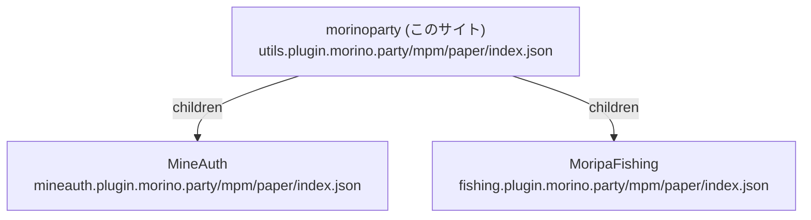

# mpm リポジトリ

このサイト (`utils.plugin.morino.party`) は、Minecraft プラグインマネージャー [mpm](https://mpm.plugin.morino.party) のリモートリポジトリとして、morinoparty のプラグインの定義を配信します。
morinoparty が開発しているプラグインの定義に加えて、MineAuth や MoripaFishing などの個別プラグインが配信する子リポジトリへのリンクを持ちます。

このリポジトリは mpm の中央リポジトリ (`repo.mpm.nikomaru.dev`) からは参照されていません。
mpm 自身の定義は中央リポジトリが持っているため、このリポジトリには含まれません。

## リポジトリの追加

このリポジトリを利用する場合は、mpm の `config.json` にリモートソースとして追加します。

```json
{
    "type": "remote",
    "url": "https://utils.plugin.morino.party/mpm/paper/index.json"
}
```

複数のソースは `config.json` の並び順で優先され、同名のプラグインは先に見つかった定義が採用されます。
設定の詳細は mpm の [config.json の仕様](https://mpm.plugin.morino.party/docs/format/config) を参照してください。

## リポジトリグラフ

mpm のクライアントは、このサイトの `index.json` を起点に、`children` に書かれたリンクを再帰的にたどってカタログを組み立てます。
このサイトの位置付けは次の図のとおりです。



同じ名前のプラグインが複数のノードに定義されている場合は、祖先側 (起点に近い側) の定義が優先されます。
そのため、子リポジトリが親の定義を上書きすることはできません。
グラフの形式の詳細は mpm の [リポジトリグラフの仕様](https://mpm.plugin.morino.party/docs/repository/graph) を参照してください。

## 配信されるファイル

| URL | 内容 |
|-----|------|
| `https://utils.plugin.morino.party/mpm/paper/index.json` | morinoparty のプラグイン定義と子リポジトリへのリンクをまとめたインデックス |

`index.json` はドキュメントサイトのビルド時に `docs/scripts/build-mpm-index.mjs` によって生成されます。
生成元となるファイルは次のとおりです。

| ファイル | 内容 |
|---------|------|
| `docs/mpm/plugins/*.json` | プラグインごとの定義 (1 プラグインにつき 1 ファイル) |
| `docs/mpm/children.json` | 子リポジトリへのリンクの一覧 |

生成された `docs/public/mpm/paper/index.json` はビルド成果物であるため、Git の管理対象には含まれません。
`docs/` 以下の変更が `main` ブランチにマージされると、ドキュメントのデプロイワークフローによってサイトと一緒に `index.json` が再生成され、公開されます。

手元で生成結果を確認する場合は、次のコマンドを実行します。

```bash
cd docs
pnpm run build:mpm-index
```
